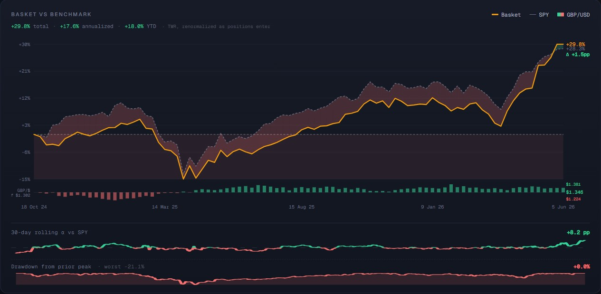
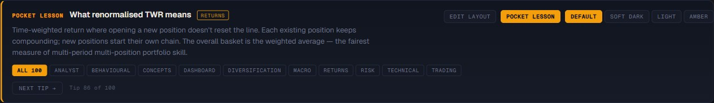
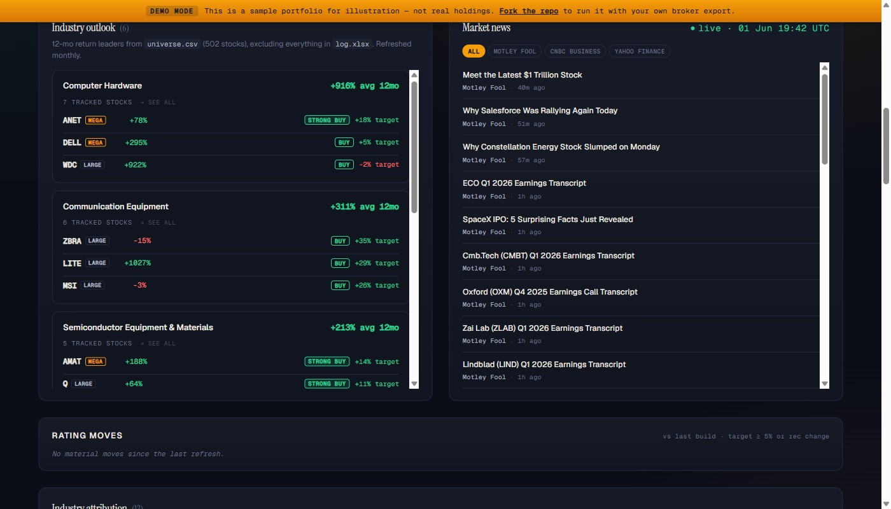
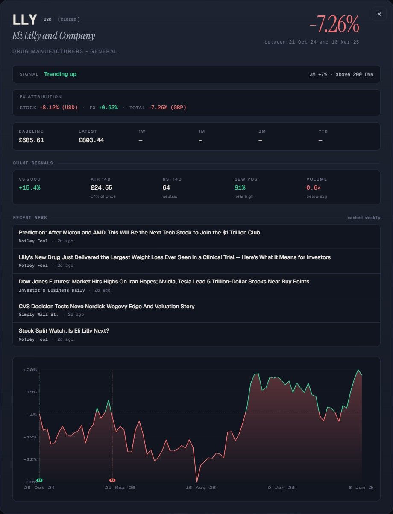
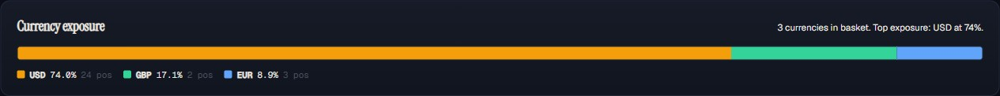
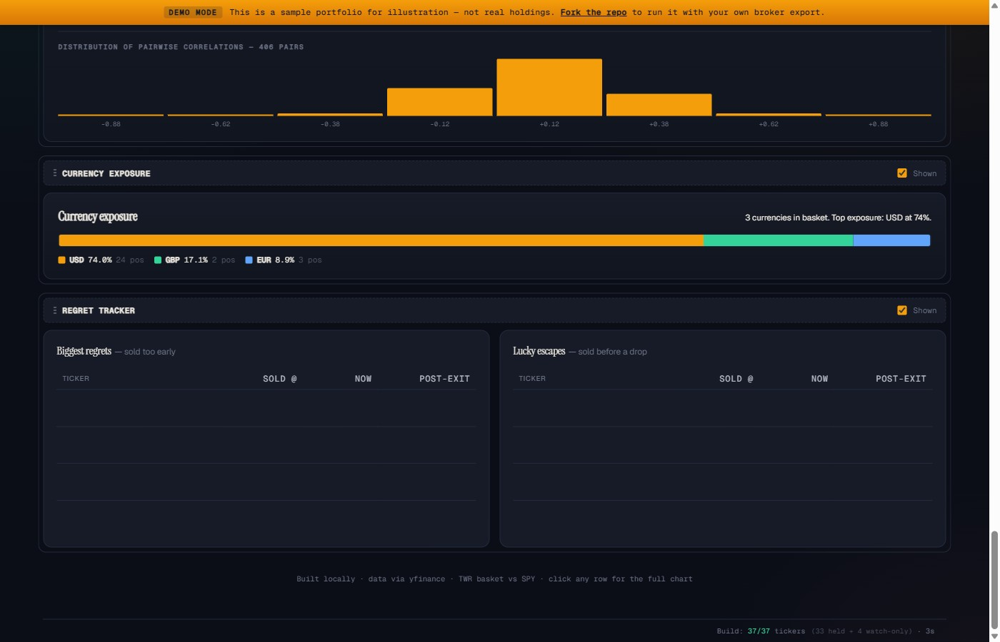

# Stocks dashboard

[](LICENSE)
[](demo.html)
[](CHANGELOG.md)
[](https://claude.com)

A personal portfolio dashboard for tracking, analysing, and acting on a basket
of stocks. Built as a **static HTML page** generated by a Python pipeline
from a transaction log, with optional live news fetched in the browser via a
small Cloudflare Worker. The author rebuilds their own private dashboard
locally from `log.xlsx`; a public **`demo.html`** built from the sample
`transactions.csv` is regenerated daily by GitHub Actions.

The author maintains this dashboard for their own portfolio, but the code is
public and reusable — fork it, point it at your own broker export, and you
have your own dashboard for the cost of a free GitHub account and a few
minutes of setup.

## Demo

Want to see what the dashboard looks like without forking or running anything?
Grab **[`demo.html`](demo.html)** from this repo and double-click it to open
in any browser — it's a **single self-contained file** (~430 KB) built from
the included `transactions.csv` sample portfolio. SortableJS is inlined, no
adjacent `vendor/` directory needed, no internet connection needed (except
to optionally fetch live news via the Cloudflare Worker).

CI rebuilds `demo.html` daily so the sample is always against current
yfinance closes.



> **Not financial advice.** This dashboard is a personal **benchmarking
> exercise** — a tool the author built to track and reflect on their own
> basket. The figures, technical signals, exit-strategy labels and re-entry
> suggestions shown here are heuristics derived from public market data; they
> are **not investment recommendations**. **Capital at risk:** past
> performance does not predict future returns, and any stock shown here can
> lose money. Do your own research, or speak to a licensed adviser, before
> acting on anything you see on this page.

> **Built with Claude Opus 4.7.** The code, design decisions, prose
> commentary and this README were developed end-to-end in pair programming
> with Anthropic's Claude Opus 4.7 model.

---

## Why this exists

The author wanted a single page that answers, every morning:

1. **How is the basket doing** vs the S&P 500 over the same window?
2. **What's pulling it up or down** at the individual-stock and at the
   industry level?
3. **What's worth buying back** that was previously held and exited?
4. **What new ideas** the market is excited about that aren't already in the
   basket?
5. **What's worth trimming or cutting** given current technical and analyst
   signals?
6. **What changed in the market overnight** via curated finance news.

Off-the-shelf tools either don't combine these views in one screen (Trading 212
shows holdings but not analyst targets; Yahoo Finance shows targets but not
your basket TWR; Bloomberg combines them but costs $24k/year) or hide
attribution analysis behind subscriptions. This project sits in the gap: free
to run, public to share, structured by the questions the author actually asks.

A deliberate design constraint throughout: **everything must work as a static
HTML file served by GitHub Pages**. No backend, no auth, no database. The
build is a Python script; the runtime is the user's browser. The Cloudflare
Worker is the one optional piece of infra, and even without it the dashboard
falls back to build-time news cleanly.

---

## Architecture at a glance

```
            ┌──────────────────────────────────────────┐
            │  Daily 08:00 UTC GitHub Actions cron     │
            │  + manual workflow_dispatch              │
            │  + push to source files                  │
            └─────────────────┬────────────────────────┘
                              │
                              ▼
                     ┌──────────────────┐
                     │   python build.py│
                     └────────┬─────────┘
                              │
        ┌─────────────────────┼─────────────────────────┐
        │                     │                         │
        ▼                     ▼                         ▼
   yfinance              Yahoo + MW RSS            Local files
   prices                (build-time news)         (log.xlsx, csv)
        │                     │                         │
        └─────────────┬───────┴─────────────────────────┘
                      ▼
            ┌───────────────────────────┐
            │  data/*.parquet caches    │
            │  data/meta.csv            │
            │  data/analyst_cache       │
            │  data/universe_outlook    │
            └─────────────┬─────────────┘
                          ▼
                ┌───────────────────────┐
                │  docs/index.html      │  ← single self-contained file
                │  (renders 9 modules)  │     ~1.5 MB, GitHub Pages serves
                └───────────────────────┘     this as the live dashboard
                          │
        ┌─────────────────┴─────────────────┐
        │     Browser loads the page         │
        │     + JS fetches live news via     │
        │       Cloudflare Worker (optional) │
        └────────────────────────────────────┘
```

Three things happen at three different cadences:

| Cadence | What runs | Where |
|---|---|---|
| **Every page load** | JS reads embedded JSON, draws hero chart + sparklines, fetches latest news from the Worker, applies filters | Browser |
| **Daily 08:00 UTC** (+ push events) | `python build.py` regenerates `docs/index.html` from `log.xlsx` and the data caches, commits + pushes | GitHub Actions |
| **Per cache TTL** (7d portfolio, 30d universe) | yfinance refetches when a cached row is older than its TTL | Inside `build.py` |

---

## What the dashboard shows

The page is organised top-to-bottom as a **decision flow** — research first,
then context, then details, then actions:

```
┌─ Header ──────────────────────────────────────────────────────────────┐
│ Edit-layout · Palette toggle · Desktop-view (on narrow viewports)    │
│ Hero subtitle: total + annualized return · TWR methodology           │
│ Unusual-volume chips (when any open name >2× vol with >1% move)      │
│ Hero chart (basket vs SPY with vs-SPY area shading + GBP/USD bars)   │
│ 30-day rolling alpha sparkline (hover for date+value)                │
│ 5 configurable stat cards (default: annualized / Sharpe / win rate / │
│ win-loss ratio / avg upside; pick from 10 via edit-mode)             │
└───────────────────────────────────────────────────────────────────────┘

┌─ Industry outlook ─────────┬─ Market news ──────────────────────────┐
│ 6 industries from universe │ Live finance headlines (Worker) or    │
│ minus log.xlsx, top 3      │ build-time RSS (fallback). Source     │
│ stocks by analyst upside,  │ filter chips: All / MarketWatch /     │
│ cap-tier badges. Click a   │ Yahoo / CNBC / Motley Fool            │
│ card → info modal with     │                                       │
│ every ticker in industry.  │                                       │
└────────────────────────────┴───────────────────────────────────────┘

┌─ Rating moves ───────────────────────────────────────────────────────┐
│ Target-price changes ≥ 5% and recommendation shifts since the last  │
│ build. Empty state on first build; populates on every subsequent    │
│ build that hit any analyst-cache TTL.                               │
└──────────────────────────────────────────────────────────────────────┘

┌─ Industry attribution ───────────────────────────────────────────────┐
│ Cost-weighted basket return decomposed by industry. Shows which     │
│ sectors are pulling the basket up or down. Horizontal bars per row. │
└──────────────────────────────────────────────────────────────────────┘

┌─ Main returns table ─────────────────────────────────────────────────┐
│ All 185 positions. Columns: Ticker · Target · Upside · Analyst ·    │
│ Signal · Trend · Last · Cost · Purchased · Since baseline · 1W /    │
│ 1M / 3M / YTD · Post-exit. Sector chip filter + status chips.       │
│ Internal scroll (sticky header). Click any row → modal chart.       │
└──────────────────────────────────────────────────────────────────────┘

┌─ Re-entry ideas (analyst panel) ─────────────────────────────────────┐
│ Top 50 closed positions ranked by analyst price-target upside.      │
│ Each card: ticker · BUY/HOLD/SELL · current price · upside % ·      │
│ technical signal pill. Highlights analyst/technical divergence.     │
└──────────────────────────────────────────────────────────────────────┘

┌─ Exit strategy (top detractors) ─────────────────────────────────────┐
│ Top 8 open positions dragging basket return down. Columns include   │
│ technical signal, analyst recommendation, and a **suggested action**│
│ from a 3×3 heuristic: HOLD / TRIM / MONITOR / REVIEW THESIS / EXIT /│
│ CUT LOSS.                                                           │
└──────────────────────────────────────────────────────────────────────┘

┌─ Biggest regrets ──────────┬─ Lucky escapes ───────────────────────┐
│ Closed positions that      │ Closed positions that fell hardest    │
│ rallied most after exit    │ after exit                           │
└────────────────────────────┴───────────────────────────────────────┘
```

### The header stats (configurable — pick 5 of 10)

The hero stat strip is a **registry** of 10 stats. The default selection is
5 of them, but every visitor can pick a different 5 (or up to 10) and reorder
them via edit-mode. The choice persists in `localStorage`.

| Slug | Stat | Definition | Why it's there |
|---|---|---|---|
| `annualized` ★ | **Annualized return** | `(1 + total_return)^(1/years) − 1`, geometric. Gated below 3 months elapsed (too noisy to annualize from a tiny window). | Time-normalized return so a 31% gain looks different at 6 months vs 19 months. |
| `sharpe` ★ | **Sharpe (1y)** | Weekly log returns annualized via `× √52`, risk-free = 0 (project convention). Color-banded green ≥ 1, red < 0. | Tells you whether the return was earned smoothly or via wild swings. |
| `win_rate` ★ | **Win rate** | % of closed positions with `total_pct > 0` | Personal skill gauge over time. Above 50% = better than random. |
| `win_loss_ratio` ★ | **Win / loss £ ratio** | `avg_win_£ / avg_loss_£` across closed positions. Distinguishes "70% wins on tiny upside + big losses" from a genuinely good strategy. | Magnitude check on the win rate. ≥ 1.5 green, < 1 red. |
| `avg_upside` ★ | **Avg analyst upside** | Cost-weighted mean of `(target / current − 1)` across open positions | Forward-looking aggregate of Wall Street consensus on the basket. |
| `total_return` | **Total return** | Cumulative basket return since inception, in %. | Optional alongside annualized when the inception date matters more than the duration. |
| `max_drawdown` | **Max drawdown** | Worst peak-to-trough decline on the basket NAV series | The single most-cited risk number in portfolio reporting. |
| `top_contributor` | **Top contributor** | The stock that has added the most to basket return | Biggest single driver of the gains. |
| `top_detractor` | **Top detractor** | The stock that has subtracted the most from basket return | Biggest single drag. |
| `positions_open` | **Open positions** | Number of currently-open positions. | Simple density gauge: a basket of 80 is a different beast from 8. |

★ = in the default 5. Total return and annualized return are also shown
inline in the hero subtitle line, so the cards can be reserved for vol- and
magnitude-adjusted measures unless the visitor overrides.

### The hero chart

A composed visualisation with several layers sharing one x-axis:

- **Amber line + filled area:** the basket's time-weighted return %
  (renormalised as positions enter, so opening a new position doesn't reset
  the line).
- **Grey dashed line:** SPY benchmark, rebased to the same starting date.
- **Vs-SPY area shading:** the area between the basket and SPY lines, painted
  green when basket is outperforming and red when underperforming. Crossover
  points split the shading at the exact moment the lead changes hands.
- **Subtle red wash below 0%:** marks the loss zone — even a brief crossing
  into the red is immediately visible.
- **Δ delta badge** at the right edge shows `Δ +4.2pp` style alpha vs SPY at
  the latest date.
- **Bottom strip — coloured bars:** weekly GBP/USD exchange rate centred on
  the baseline value. Green = pound stronger than baseline, red = weaker.

Hovering shows a tooltip with all three values at the hovered week. **Clicking
a weekly point** opens an info modal listing that week's top up / down movers
across the basket.

Beneath the main chart sit two inline sparklines:

- **30-day rolling alpha** — basket excess return vs SPY over the trailing
  30 days, in percentage points. The line splits at every zero crossing —
  green where the basket led SPY, red where it trailed. The color flip
  lands exactly on the baseline (linearly interpolated), not at the next
  data point. Hovering shows the date + value at the nearest point.
- **Drawdown from prior peak** — a thin red line plotting peak-to-trough
  drawdown at each date over the full basket history. The header pill
  shows the current drawdown alongside the worst seen (e.g. `worst -15.6%`)
  so the eye can answer "how close are we to the prior trough?" at a glance.

### Pre-hero context: unusual volume chips

When any open position trades on **&gt; 2&times; its 63-day average volume**
with a non-trivial day move (&gt; 1%), an amber chip pinned just under the
hero subtitle calls it out: `DELL +32.5% 4.9× vol`. Up to 3 chips; clicking
one opens the ticker modal. Hides cleanly when nothing qualifies.

### Pocket lesson card (opt-in)

A small educational card that you can toggle from the topbar. When on,
it shows one of 100 short 3–4 sentence lessons tied to a concept the
dashboard actually surfaces — TWR, Sharpe, drawdown, alpha, RSI, sector
concentration, the 2&times; ATR stop, and so on. Pick a category
(Returns, Risk, Behavioural, Macro, Technical, Analyst, Trading,
Diversification, Dashboard) to narrow the pool, then click **Next tip**
to rotate. Off by default; preferences persist in `localStorage`.



### Decision-flow ordering

The vertical order is deliberate — research → context → details → action:

1. **Outlook + News** at top: "what should I read about today" — new
   stocks and the market backdrop.
2. **Rating moves**: "did analyst views shift since last build" — diffs
   of this build's analyst cache vs the prior build, surfacing target-price
   changes ≥ 5% and recommendation shifts.
3. **Attribution**: "which of my sector bets are paying off" — situational
   awareness of the basket as a whole.
4. **Main table**: detailed per-stock view with sorting + filtering.
5. **Re-entry ideas**: "of stocks I've held before, where do analysts see
   most upside" — buy candidates.
6. **Exit strategy**: "of my current losers, which should I cut" — sell
   candidates, with concrete 2× ATR suggested stops.
7. **Basket diversification**: portfolio-level lens — pairwise correlations,
   most-correlated pairs (concentration risk), and best diversifiers.
8. **Regrets / Lucky escapes**: retrospective — did I sell too early or
   exit just in time.

This ordering matches how the author actually reviews the portfolio: you
read about the market first, look at how your sectors are doing, dig into
specific positions, then decide what to buy or sell.

### Click-to-expand drill-downs

Most numbers on the page open a focused info modal showing the breakdown:

- **Industry-outlook card** → every ticker in that industry from the universe,
  sorted by 12-mo return.
- **Industry-attribution row** → every open position in that industry with
  weight, return, and contribution.
- **Diversification tickers** ("Best diversifiers" / "Most correlated") → the
  ticker's detail modal.
- **Correlation histogram bar** → every pair whose correlation falls in
  that bucket.
- **Hero chart weekly point** → top up / down movers across the basket
  that week.

Modals **stack**: clicking a ticker inside an info modal opens the ticker
modal *on top*; Escape closes the topmost first, the underlying info modal
on a second Escape. This lets you drill from "show me this industry" to
"show me one stock in it" without losing your place.



This is only the **default**, though. Anyone can drag the sections into a
different order or hide the ones they don't use — see
[Customizable module layout](#customizable-module-layout).

---

## Key design decisions

### Static site, no backend

GitHub Pages is free and hosts static files only. Every dynamic feature on
this page is either pre-computed at build time (most of it) or fetched
client-side from a public Worker (just the live news). There's no database,
no API key, no auth, no server logs. Restoring the site after an outage is
`git push`.

### Recency-based open/closed classification

A position is **closed** when its most recent transaction (in `log.xlsx`) is
a SELL, **open** otherwise. This rule is robust to partial exits and to
multi-cycle tickers (e.g., a stock bought, sold, bought again, sold again
would correctly classify as closed at the end). Net-share math would
misclassify these because Trading 212-style exports don't include per-row
share quantities.

### Two-tier caching with different TTLs

Analyst price-target and recommendation data is fetched from `yf.Ticker().info`:

| Pool | Tickers | TTL | Why |
|---|---|---|---|
| **Portfolio holdings** | ~185 (open + closed in `log.xlsx`) | **7 days** | Trading decisions need fresh signal; weekly refresh is enough since analyst targets don't shift on a daily basis. |
| **Reference universe** | 151 from `universe.csv` | **30 days** | Used only for the industry outlook section. Industry rankings move slowly; monthly is plenty. |

Both caches are committed to the repo (in `data/`) so CI builds reuse them
instead of refetching on every run.

### Time-weighted return (TWR), not money-weighted

The basket line is computed as `sum(w_i * ((p_i,t / p_i,base_i) - 1)) / sum(w_i)`
over tickers whose `baseline_date <= t`. This means adding a new position
doesn't drop the basket line — it just "joins" at its baseline. TWR is the
industry standard for performance reporting because it isolates pure stock-
selection skill from cash-flow timing.

### Quant signals (modal sub-row)

Clicking any row opens a modal whose lower half shows five per-stock technical
metrics, refreshed every build:

| Metric | What it tells you | How to read it in practice |
|---|---|---|
| **vs 200d** | Distance from the 200-day SMA in %. Above zero = price still riding the long-term trend; well below = trend has broken. | `+19%` (recent AAPL): comfortably above its long-term average, trend intact. `-69%` (SQQQ.L): trend decisively broken; only a mean-reversion bet, not a trend trade. |
| **ATR 14d** | 14-day Wilder Average True Range, quoted in **GBP**, with the % of price beside it. Use it to size stops — a stop set ~2× ATR below entry usually sits outside normal noise. | `£4.13 · 1.8%` (recent AAPL): typical daily swing is ~£4, so a stop ~£8 below entry survives a normal-volatility day. A name reading `4.0%` is roughly twice as twitchy — give it more room, or take a smaller position. |
| **RSI 14d** | Classic Wilder RSI. **≥ 70** flags overbought (red), **≤ 30** flags oversold (green). | `79` (recent AAPL): stretched — a pullback wouldn't be a surprise; not the ideal moment to add. `29` (recent WMT): washed out — watch for a bounce. `50` ≈ no momentum bias either way. |
| **52w pos** | Where today's price sits between the 52-week low (0%) and high (100%). Near-high = breakout candidate; near-low = potential value or broken trend. | `100%` (recent AAPL): at the 52-week high — breakout territory, but no headroom left. `5%`: near the lows — either deep value or a broken trend; cross-check with **vs 200d** to tell which. `50%` = mid-range, no strong directional signal. |
| **Volume** | Today's volume divided by the 63-day average. **≥ 1.0** = institutional support behind the move; **< 1.0** = thinly-traded, less trustworthy. | `1.3×` (recent AAPL): above-average participation — the day's price move is credible. `0.4×`: quiet, thin trading — any sharp move can fade quickly and shouldn't be treated as a real signal. |

A common combined read: a stock at **52w pos ≈ 100%**, **RSI > 75**, on
**Volume ≥ 1.5×** is a high-conviction breakout — but probably too late to
chase. The same name with **Volume < 0.7×** is a suspect move likely to
reverse. **RSI < 30** on a name still well **above its 200-day SMA** is the
classic "buy-the-dip" setup; the same RSI on one **40% below 200d** is just
a falling knife.

Source data is the full OHLCV cached in `data/ohlcv_cache.parquet` (one
yfinance batch per build, same lifecycle as the close-only cache). The
close-only `prices_cache.parquet` is left untouched — everything else in the
pipeline still reads its existing shape.



### Per-ticker recent news (in the modal)

Each modal also shows up to **5 recent news headlines for that specific
stock**, fetched at build time from `yfinance.Ticker(t).news` and cached to
`data/ticker_news_cache.parquet` with a **7-day TTL** (same lifecycle as the
analyst cache). Most builds reuse the parquet; only ~one build per week per
ticker actually re-fetches.

The section sits between the "Quant signals" row and the price chart, so the
modal flow reads: *signal → quantitative state → why-is-this-moving → price
history*. Each row shows the headline, publisher (e.g. Bloomberg, Reuters,
Motley Fool), and a relative timestamp (`1h ago`, `8h ago`, etc.). Tickers
without news available from yfinance (mostly LSE-listed commodity ETFs) hide
the section entirely so the modal stays clean.

### Exit-strategy heuristic

A 3×3 grid joining technical signal tone × analyst recommendation:

|                    | Analyst BUY | Analyst HOLD | Analyst SELL |
|--------------------|-------------|--------------|--------------|
| **Pos signal**     | HOLD        | TRIM         | EXIT         |
| **Neutral signal** | HOLD        | MONITOR      | EXIT         |
| **Neg signal**     | REVIEW THESIS | TRIM       | CUT LOSS     |

Two divergent signals = high conviction. Two agreeing signals = act.
**This is build-time analytics, not financial advice** — the user makes
the actual call.

Each detractor row also surfaces a **2× ATR suggested stop** sub-line below
the action pill — e.g. `Stop £92.82 ($124.96) −2× ATR`. The GBP value is for
dashboard consistency; the parenthetical native-currency value is what you'd
actually type into the broker. A stop placed two ATRs below the current price
typically sits outside normal daily noise — close enough to limit damage if
the thesis breaks, wide enough not to be shaken out on a routine red day.

**Worked example.** A recent MSTR row read `CUT LOSS` with
`Stop £103.24 ($138.99) −2× ATR`. MSTR was trading around £146.40 with a
14-day ATR of £21.58 — the stop sits ~13% below current price. That's the
trade-off the heuristic makes concrete: if you'd accept a 13% drawdown
before admitting the thesis is wrong, leave the position open and use £103
as the hard line. If 13% feels too painful given your conviction, the
`CUT LOSS` label is telling you to size down today rather than continuing
to negotiate with yourself.

### Re-entry idea cards — RSI context

Each card in the **Re-entry ideas** module shows a small **RSI 14d pill**
beside the technical-signal label, color-coded with the same convention as
the modal: red for ≥70 (overbought — wait for a pullback), green for ≤30
(oversold — potential mean-reversion entry), neutral otherwise. Combined
with the upside %, this answers two questions at once: *how much room does
Wall Street see, and is right now a sensible moment to act?*

**Worked examples.**
- **CRWD with RSI 84** (red pill): analysts may still flag double-digit
  upside, but the stock is stretched right now — buying here often means
  immediately sitting through a pullback. A patient re-entry waits for
  RSI to cool back below 70.
- **PNR with RSI 30** (green pill): washed out near oversold. Combined
  with positive analyst upside, this is the textbook "buy the dip"
  alignment — entering weakness, not chasing strength.
- **ROP with RSI 43** (neutral): middling momentum tells you nothing
  either way; trade the thesis (upside %, analyst rec) without weighting
  the timing.

### Basket diversification

Computed from **6 months of native-currency daily returns** across every
currently-open position. The module renders three summary panels plus a
small histogram of the full pairwise-correlation distribution.

| Panel | What it tells you | How to read it in practice |
|---|---|---|
| **Avg pairwise correlation** | Mean of every pair's daily-return correlation. The headline diversification score in one number, color-coded green below `+0.30`, red above `+0.60`. | `+0.20` (recent basket): well diversified — most pairs only weakly co-move. `+0.50` would mean every pair shares roughly half its move. **Above `+0.60`** = the basket is effectively one big bet wearing many tickers. |
| **Most correlated — concentration risk** | Top 3 pairs ranked by correlation. Concentration warning: paying transaction costs to hold names that move as one. | `GLDW.L ↔ SGLN.L = 1.00` (recent): two physically-backed gold ETFs — literally the same trade. Consolidate into one. `AMAT ↔ LRCX = 0.88`: same semi-equipment sub-industry; high correlation is expected, but ask whether you'd be comfortable doubling the bigger one instead. |
| **Best diversifiers — lowest avg ρ vs rest** | The three positions whose mean correlation with every other open name is closest to zero (or negative). These are doing real diversification work. | `ICSU.L = −0.13` (recent): a short-duration treasury / money-market ETF that moves slightly inverse to the rest. Sizing this up cuts basket drawdown more than sizing up any single equity. |
| **Histogram** | The distribution of every pairwise correlation across eight 0.25-wide buckets between `−1.00` and `+1.00`. Hover a bar for the exact range and count. | A **right-skewed mound centred near `+0.10` to `+0.30`** (current shape) is the healthy pattern — most pairs only weakly relate. A tall bar in the `+0.75` to `+1.00` bucket = duplicated bets; a near-empty middle with a tall right-side cluster = a concentrated theme dressed in many tickers. |

**Combined read.** The current basket shows avg `+0.20` (well diversified)
*and* a histogram peaking in the `+0.00` to `+0.25` bucket — those agree.
The dashboard still flags `GLDW.L ↔ SGLN.L = 1.00` as a concentration
risk: a healthy basket overall doesn't mean every individual decision is
optimal, and the panel surfaces the specific pair worth acting on.

### Multi-currency normalisation

All displayed values are in **GBP**. Native-currency prices are downloaded
from yfinance, FX rates are pulled separately, and `convert_to_base()`
applies daily FX to produce a base-currency price series. London-listed
pence-quoted symbols (GBp / GBX) are divided by 100. The hero chart's FX
bars surface this layer of the math directly.

### Currency exposure breakdown

A horizontal stacked bar groups your open-position cost basis by native
currency, so you can see at a glance how much of the basket is exposed
to each FX line. When one currency dominates above 80%, the section
prints an explicit concentration warning. Useful as a reality check
against the "I just hold international stocks" framing — most baskets
are 70–90% USD by cost basis even when they look diversified by name.



### 4-palette theming

The CSS uses semantic custom properties (`--ink`, `--surface`, `--text`,
`--up`, `--down`, `--accent`). Switching palettes is just swapping the
class on `<body>`, which redefines the variable values. The user can pick
Default (dark amber), Soft Dark (lighter), Light (FT/NYT cream), or
Bloomberg (terminal amber/black). Choice persists via `localStorage`.

### Customizable module layout

Every section below the hero is a self-contained **module**. An "Edit layout"
button (top-right, beside the palette toggle) flips the page into edit mode,
revealing a drag handle and a show/hide toggle on each module. Drag to reorder
(powered by [SortableJS](https://sortablejs.github.io/Sortable/), vendored into
`docs/vendor/` so there's no CDN dependency), untick to hide, "Reset" restores
the default.

Order and hidden state persist in `localStorage` (`stocks-dashboard-layout-v1`),
so a customised layout survives rebuilds — `build.py` only ships the *default*
order, and each visitor's overrides live in their own browser. Same
client-side-state pattern as the palette toggle. If the author later adds a new
section, it slots into its default position for everyone — including visitors
who already customised — so nobody silently loses it. This is why people who
clone the repo each get a layout they can tailor without touching `build.py`.

Edit mode also exposes the **hero stat picker**: each stat card grows a small
drag grip + show/hide checkbox, and the user can swap in/out any of the 10
stats in the registry. Persisted under `stocks-dashboard-stats-v1`. **Reset**
clears both module layout and stats selection back to defaults in one click.



### Desktop-view override on narrow viewports

When the page is opened on a screen narrower than 900 px, a **"Desktop view"**
button appears in the topbar. Tapping it sets `body { min-width: 1100px }` so
the full desktop layout renders instead of the responsive mobile collapse —
the page becomes horizontally scrollable on phones, but every column,
sparkline, and stat card is visible. Same toggle flips back. Choice persists
under `stocks-dashboard-force-desktop`. Wikipedia / Reddit ship the same
pattern for the same reason.

---

## File structure

```
stocks-dashboard/
├── README.md                          ← this file
├── LICENSE                            ← MIT
├── CHANGELOG.md                       ← version history (v1.0 → v1.7)
├── demo.html                          ← standalone self-contained demo (CI-rebuilt daily)
├── build.py                           ← the build pipeline
├── log.xlsx                           ← author's transaction log (private, gitignored)
├── transactions.csv                   ← public sample log used by demo.html
├── watchlist.csv                      ← optional watchlist tickers
├── universe.csv                       ← 150 large/mid/small US caps for industry outlook
├── requirements.txt                   ← Python deps
├── daily_rebuild.ps1                  ← optional Task Scheduler script for daily local rebuilds
├── setup_scheduled_task.ps1           ← one-shot installer for the scheduled task
├── .gitignore
│
├── .github/
│   └── workflows/
│       └── build.yml                  ← daily 08:00 UTC cron + push triggers
│
├── data/                              ← all caches (committed, reused by CI)
│   ├── prices_cache.parquet           ← native-currency closes, all tickers
│   ├── ohlcv_cache.parquet            ← full OHLCV (for ATR / Volume metrics)
│   ├── benchmark_cache.parquet        ← SPY prices
│   ├── fx_cache.parquet               ← FX pairs (USDGBP, EURGBP, etc.)
│   ├── meta.csv                       ← sector / industry / name / currency
│   ├── analyst_cache.parquet          ← yf.info per ticker, 7-day TTL
│   ├── prior_analyst_cache.parquet    ← previous build's analyst snapshot for rating-moves diff
│   ├── ticker_news_cache.parquet      ← per-ticker news for the modal, 7-day TTL
│   └── universe_outlook_cache.parquet ← universe.csv precomputed, 30-day TTL
│
├── docs/
│   ├── index.html                     ← generated dashboard (~1.5 MB)
│   ├── assets/                        ← README screenshots (one-time committed)
│   │   ├── demo-hero.jpeg
│   │   ├── demo-modal.jpeg
│   │   ├── demo-outlook-news.jpeg
│   │   └── demo-edit-layout.jpeg
│   └── vendor/
│       └── Sortable.min.js            ← drag-reorder lib (vendored, no CDN)
│
└── worker/                            ← optional Cloudflare Worker
    ├── index.js                       ← RSS proxy + finance-keyword filter
    ├── wrangler.toml                  ← deploy config
    ├── .gitignore
    └── README.md                      ← deploy instructions
```

---

## Data flow inside `build.py`

```python
main()
├── load_transactions_from_log()       # parse log.xlsx
├── load_watchlist()                   # parse watchlist.csv (optional)
├── download_ohlcv(tickers)            # one yfinance batch: full OHLCV per ticker
├── download_benchmark()               # SPY
├── load_meta_cache() + fetch_meta()   # sector/industry/currency per ticker
├── download_fx(needed_pairs)          # USDGBP, EURGBP, etc.
├── convert_to_base(prices, meta, fx)  # native → GBP
├── build_positions(transactions, prices)        # returns table
├── compute_basket_mtm_series()        # TWR series
├── compute_benchmark_series()         # SPY rebased
├── compute_rolling_alpha()            # 30-day trailing basket excess vs SPY (v1.6 sparkline)
├── compute_contributors()             # per-ticker contribution_pp
├── compute_signals()                  # technical signal per ticker
├── compute_quant_metrics()            # SMA200 / ATR / RSI / 52w / Volume per ticker
├── snapshot_prior_analyst()           # v1.7: copy current analyst cache for next-build diff
├── fetch_analyst_data(all_tickers, cache, ttl=7d)
├── compute_rating_moves()             # v1.7: diff prior vs current analyst cache
├── fetch_ticker_news(all_tickers, cache, ttl=7d) # v1.5: per-ticker modal news
├── load_universe() + fetch_universe_outlook(universe, ttl=30d)
├── fetch_news()                       # build-time RSS fallback
└── render_html(...)                   # → write docs/index.html
        └── build_aux_payload()        # v1.7: click-to-expand modal lookup tables
```

`render_html()` is a single big f-string that templates the entire page. All
JS lives inside one `<script>` block at the bottom; all CSS is in one
`<style>` block at the top. Sections are produced by small helper renderers
(`render_table`, `render_detractors_strategy`, `render_industry_outlook`, etc.)
and stitched together in render order matching the decision-flow layout.

---

## The Cloudflare Worker (optional)

The Worker at `worker/index.js` is a small **CORS-headed RSS proxy** that
serves finance headlines as JSON. It exists because Yahoo Finance and
MarketWatch RSS feeds don't include CORS headers, so the browser can't fetch
them directly from a static page. The Worker fetches them server-side
(no CORS rules in Node), normalises the XML to JSON, and returns them with
`Access-Control-Allow-Origin: *`.

Three things the Worker does for free:

1. **Source-allowlists** to a hand-picked set of finance feeds (MarketWatch
   market-pulse + real-time, Motley Fool, CNBC Business, Yahoo Finance top
   stories). Keeps it from being an open proxy.
2. **Filters by finance keywords** so non-finance items leaking into top-story
   feeds (politics, lifestyle) get dropped.
3. **Edge-caches for 10 minutes**, so even a busy day's worth of visitors
   triggers maybe 30-40 upstream fetches.

If you don't deploy the Worker, the dashboard still works — the news section
falls back to build-time fetched content (refreshed once per CI cycle, so up
to 24 hours stale). Deploying the Worker upgrades news to live-per-page-load.

Full deploy instructions: [worker/README.md](worker/README.md).

---

## Setup if you're forking this

1. **Fork the repo** on GitHub. You get `<your-username>/stocks-dashboard`.
2. **Replace `log.xlsx`** with your own Trading 212-style export, or delete
   it and use `transactions.csv` (simpler CSV format — see the demo file).
3. **Enable Pages**: Settings → Pages → Source: "Deploy from a branch" →
   branch `main`, folder `/docs`. The URL becomes
   `<your-username>.github.io/stocks-dashboard`.
4. **(Optional) Deploy the Worker** for live news per the
   [worker/README.md](worker/README.md).
5. **Edit `universe.csv`** to taste — it's just a list of tickers to compare
   industry performance against. The default is the full S&P 500 (503
   tickers across 112 industries); shrink it to a smaller hand-picked
   list if you want a faster monthly refresh.
6. **First build**: trigger Actions → Scheduled rebuild → Run workflow.
   The first run takes ~2 minutes because all caches are cold.

To run locally without pushing:

```bash
python -m venv .venv
.venv\Scripts\activate          # Windows (use 'source .venv/bin/activate' on macOS/Linux)
pip install -r requirements.txt
python build.py
# open docs/index.html in any browser
```

---

## Switching data sources if yfinance breaks

`yfinance` is an unofficial Yahoo Finance scraper. Yahoo occasionally
tweaks its internal API; when that happens, `pip install -U yfinance`
fixes it within a day or two of the community patch. But if you want
to harden the build against that risk (or just prefer not to depend on
a scraping library at all), here are two free stacks that cover what
this project actually needs.

**What `yfinance` provides today, and which cache it fills:**

| Cache | Field | Used by |
|---|---|---|
| `prices_cache.parquet` | Daily Close in native ccy | hero chart, sparklines |
| `ohlcv_cache.parquet`  | OHLCV (volume + range)   | quant signals, unusual-vol |
| `fx_cache.parquet`     | GBP/USD, EUR/GBP etc.    | currency normalisation |
| `benchmark_cache.parquet` | SPY closes            | hero chart benchmark |
| `meta.csv`             | name, sector, industry   | every section that labels a ticker |
| `analyst_cache.parquet` | target, recommendation, market cap | analyst panel, industry outlook |
| `universe_outlook_cache.parquet` | 12-mo return + analyst for the universe | industry outlook |

### Option A: Stooq (prices + FX) via `pandas-datareader`

Stooq is a Polish data aggregator that mirrors global EOD prices over
plain HTTP. No API key, no rate limits, multi-year history,
multi-currency, multi-exchange. Ideal for the bulk price + FX layer.

```python
import pandas_datareader.data as pdr
prices = pdr.DataReader("AAPL.US", "stooq", start, end)   # daily OHLCV
fx     = pdr.DataReader("GBPUSD",  "stooq", start, end)
```

- **Covers**: `prices_cache.parquet`, `ohlcv_cache.parquet`,
  `fx_cache.parquet`, `benchmark_cache.parquet` (use `SPY.US`),
  the 12-mo return half of `universe_outlook_cache.parquet`.
- **Doesn't cover**: `meta.csv`, `analyst_cache.parquet`, or the
  analyst half of the universe outlook.
- **Ticker format**: requires suffixes — `.US`, `.UK`, `.DE`,
  `.FR`, `.NL`. London `.L` &rarr; `.UK`, Paris `.PA` &rarr; `.FR`,
  Amsterdam `.AS` &rarr; `.NL`. A one-time mapping in the build covers it.

### Option B: Financial Modeling Prep (FMP) for the metadata + analyst layer

FMP's free tier is **250 API calls/day** with a free key. It has the
exact endpoints needed for the metadata + analyst caches that Stooq
can't fill.

```python
import requests, os
key = os.environ["FMP_KEY"]
r = requests.get(f"https://financialmodelingprep.com/api/v3/profile/AAPL?apikey={key}")
# returns name, sector, industry, mktCap in one call
r = requests.get(f"https://financialmodelingprep.com/api/v3/analyst-estimates/AAPL?apikey={key}")
```

- **Covers**: `meta.csv`, `analyst_cache.parquet`, market cap
  (for the `cap_tier` field).
- **Quota fit**: held basket weekly refresh (~187 calls) sits at
  ~27 calls/day. The monthly 500-ticker universe refresh fills two
  consecutive days of quota; the 30-day cache absorbs it.
- **Coverage**: US-listed names are full; London/Euro coverage is
  patchier than Yahoo, so a few non-US holdings may need a manual
  metadata override in `meta.csv` (already done today for tickers
  yfinance returns nothing for).

### Hybrid stack recommendation

The cleanest swap is **Stooq + FMP together** &mdash; Stooq for the
high-volume daily price refresh (no rate limit means you can fetch
the universe daily if you want), FMP for the lower-volume monthly
metadata + analyst lookups. Migration would mean two new fetchers in
`build.py` behind a feature flag, with `yfinance` kept as the default
until the swap is verified end-to-end on a fork.

### What to skip

- **Alpha Vantage** — was usable when the free tier was 500/day, but
  it's now 25/day. Not viable for this volume.
- **Twelve Data** — 800/day is okay for prices but analyst data is
  paywalled, so you'd only use it for prices where Stooq is better.
- **Polygon.io free** — 5 calls/min is too slow for a 500-ticker
  monthly refresh.
- **Yahoo scrapers** (`yahooquery`, `stockdex`) — same upstream
  source as yfinance, so they break on the same Yahoo tweaks. Not
  real diversification.

---

## Known limitations

1. **Share-quantity approximation.** Trading 212-style exports don't include
   per-row share counts. The build treats each trade row as "1 unit," which
   inflates `total_invested` for multi-cycle tickers (e.g., COFF: 3 buys + 4
   sells over 4 cycles overstates the actual cost basis). The author has
   accepted this — the *transactional-recency* rule for open/closed
   classification is independent of the share math and is robust.
2. **Industry outlook is bounded by `universe.csv`.** The default is the
   full S&P 500 (503 tickers). Truly broad coverage (Russell 2000, global
   indices) would require either a paid screener feed or hardcoding
   thousands of tickers.
3. **Worker is unmanaged for forks.** Forks inherit the source code but get
   their own `workers.dev` URL after running `wrangler deploy`. The
   `NEWS_WORKER_URL` constant in `build.py` must be updated by each fork
   independently.
4. **Yahoo Finance data quality** for small caps and foreign listings is
   sometimes flaky (missing analyst targets, occasional NaN price points).
   The build skips gracefully when this happens; the rest of the dashboard
   still ships.
5. **No real-time prices.** yfinance gives end-of-day closes only.
   Intraday is a separate problem with no free solution at scale.

---

## Refresh cadence summary

| Layer | How often | What triggers it |
|---|---|---|
| **News headlines** (live, via Worker) | Every page load | Browser fetch on load |
| **News headlines** (build-time fallback) | Per CI build | Daily 08:00 UTC or push |
| **yfinance daily prices** | Per CI build | Daily 08:00 UTC or push |
| **Analyst targets (portfolio)** | 7-day TTL per ticker | Daily CI checks fetched_at |
| **Universe outlook** | 30-day TTL on whole cache | Daily CI checks file mtime |
| **Industry classification (`meta.csv`)** | Once per new ticker | Cached forever; only fetched on first encounter |

In practice, opening the live URL gives you news fresh to the minute (if the
Worker is deployed) and prices/analyst data fresh to within the last day.

---

## Tech stack

- **Python 3.11** — build pipeline (`pandas`, `yfinance`, `feedparser`,
  `pyarrow`, `openpyxl`).
- **Vanilla HTML / CSS / JS** in the rendered page. No frameworks, no
  bundler, no transpilation. The whole page is a single ~2.2 MB file.
- **[SortableJS](https://sortablejs.github.io/Sortable/)** for the
  drag-to-reorder module layout. Vendored into `docs/vendor/` so there's
  no CDN dependency.
- **Cloudflare Workers** (free tier) for the news proxy. Zero npm
  dependencies in the Worker — RSS parsing via regex.
- **GitHub Actions** for the daily build + commit + push.
- **GitHub Pages** for hosting.

Total monthly cost: **$0**. The author has run this in production for
months at this cost.

---

## Acknowledgements

This project would not exist without:

- **[yfinance](https://github.com/ranaroussi/yfinance)** — the unofficial
  Yahoo Finance API that powers every price, FX rate, analyst target, and
  news headline in the dashboard.
- **[SortableJS](https://sortablejs.github.io/Sortable/)** — the
  drag-and-drop library powering the customizable module layout.
- **[Cloudflare Workers](https://workers.cloudflare.com/)** — the free
  serverless platform hosting the optional RSS proxy.
- **[feedparser](https://feedparser.readthedocs.io/)** — Python RSS / Atom
  parser used by the build-time news fetch.
- **[Anthropic's Claude Opus 4.7](https://claude.com)** — the code,
  design decisions, prose commentary, and this README were developed
  end-to-end in pair programming with Claude.

---

## Roadmap / open ideas

Deferred from v1.8 (candidate for v1.9):

- **Drawdown sparkline hover** — the inset currently has no
  date/value tooltip on mouseover; the alpha sparkline above it does.
- **Per-segment color on the modal chart** — the per-ticker modal
  polyline still uses a single colour matching the position's total
  return sign; same zero-crossing split as the alpha sparkline would
  make below-baseline periods read at a glance.

Other ideas:

- **Currency exposure breakdown** — pie chart of cost basis by FX currency
  to make currency risk explicit.
- **Dividend tracking** — Trading 212 exports include dividend rows; could
  surface as annual income and yield estimate.
- **Lazy-loaded modal data** — the ~2.2 MB page weight is dominated by the
  per-ticker JSON; lazy-load on modal open would cut first paint.
- **Sector heatmap** — alternative to the industry-outlook list, showing
  all 11 GICS sectors at a glance with 12-mo return colour-mapped.

Contributions and forks welcome — see [LICENSE](LICENSE) for terms.

---

## License

Released under the [MIT License](LICENSE). In short: fork it, modify it,
sell it, build on top of it — just keep the copyright notice in any
substantial copy of the code.
